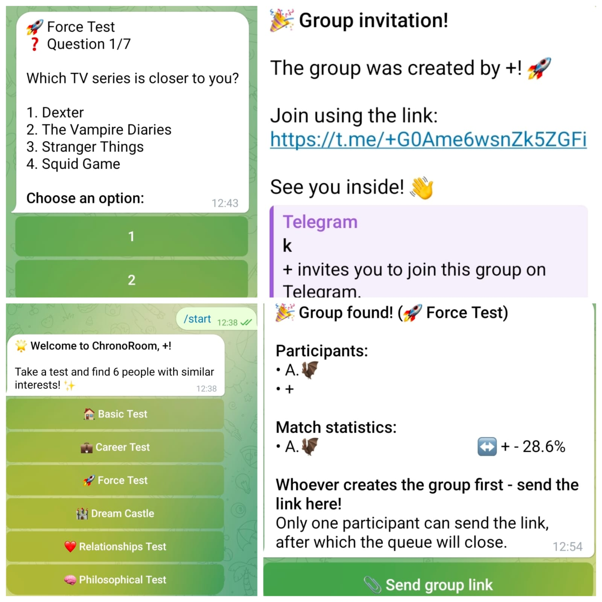

# ChronoRoom — Compatibility Matchmaking Bot

A Telegram bot that helps people find others with similar interests, preferences and communication styles.

Users take one of several short tests, enter a matchmaking queue, and are grouped with other participants who gave similar answers. The bot also calculates compatibility statistics for members of each group.

## 📸 Demo



## ✨ Features

- 🧠 6 different compatibility tests
- 🔎 Matchmaking based on users' answers
- 👥 Automatic groups of 7 participants
- 📊 Pairwise compatibility percentages
- 💾 Persistent user and matchmaking data
- 📋 Separate queues for each test type
- 🔗 Group creation and invitation handling
- 🔐 Configuration separated from application logic

## 🧪 Available Tests

### 🏠 Basic Test
Questions about everyday habits, leisure, learning, problem solving, social preferences and lifestyle.

### 💼 Career Test
Questions about work style, teamwork, motivation, mistakes, communication and professional preferences.

### 🏰 Dream Castle
A creative personality-style test built around an imaginary castle and symbolic choices.

### 🚀 Force Test
Questions about entertainment and interests, including TV series, games, music and online content.

### ❤️ Relationships Test
Questions about communication, friendship, care, conflict resolution and new acquaintances.

### 🧠 Philosophical Test
Abstract and imaginative questions about the future, consciousness, values and hypothetical situations.

Each test contains 7 questions with 4 possible answers.

## 🔄 How Matchmaking Works

1. The user chooses a test.
2. The bot presents the questions one by one.
3. The user's answers are stored in the database.
4. The user enters the matchmaking queue for that test.
5. When 7 participants are available, a group is created.
6. The participants are removed from the queue.
7. The bot calculates compatibility between every pair of participants.
8. Compatibility results are displayed as percentages.

The compatibility score is based on the proportion of matching answers between two users.

## 🗄️ Database

The bot uses SQLite and stores three main types of data:

- **Users** — Telegram user information, test answers and test type.
- **Match queue** — users currently waiting for a match.
- **Matches** — created groups, participants, test type and invitation data.

User answers are stored as JSON, allowing the same database structure to handle different test types.

## 🧩 Project Structure

```text
ChronoRoom-Bot/
│
├── config.py
├── database.py
├── matcher.py
│
├── basic_test_questions.py
├── career_test_questions.py
├── castle_test_questions.py
├── force_test_questions.py
├── philosophical_test_questions.py
└── relationships_test_questions.py
